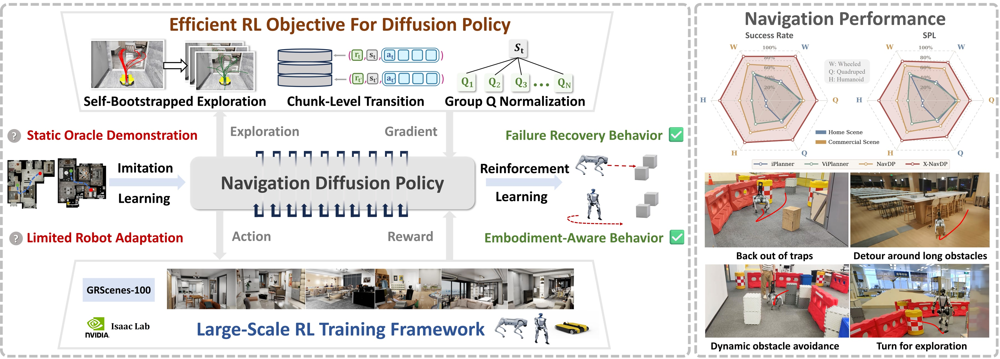

<p align="center">
  <h1 align="center"><strong>X-NavDP</strong></h1>
  <h2 align="center">Generalizing Navigation Diffusion Policy to Novel Behavior and Embodiments with Group Q-score Reweighted Matching</h2>
  <p align="center">
    <a href="/cpfs/user/yangtianyu/NavDP/baselines/x-navdp/outputs/evaluation/quadruped_commercial" target="_blank">Tianyu Yang</a><sup>1,2*</sup>&emsp;
    <a href="https://jzengym.github.io/JZENGYM/" target="_blank">Yiming Zeng</a><sup>3,2*</sup>&emsp;
    <a href="https://wzcai99.github.io/" target="_blank">Wenzhe Cai</a><sup>2*</sup>&emsp;
    <a href="https://yuqiang-yang.github.io/" target="_blank">Yuqiang Yang</a><sup>2</sup>&emsp;
    <a href="https://steinate.github.io/" target="_blank">Jiaqi Peng</a><sup>4,2</sup>&emsp;
    <a href="https://scholar.google.com/citations?view_op=search_authors&mauthors=Hui+Cheng+Sun+Yat-sen+University&hl=en" target="_blank">Hui Cheng</a><sup>3</sup>&emsp;
    <a href="https://oceanpang.github.io/" target="_blank">Jiangmiao Pang</a><sup>2</sup>&emsp;
    <a href="https://tai-wang.github.io/" target="_blank">Tai Wang</a><sup>2&dagger;</sup>
  </p>
  <p align="center">
    <sup>1</sup>Fudan University&emsp;
    <sup>2</sup>Shanghai AI Laboratory&emsp;
    <sup>3</sup>Sun Yat-sen University&emsp;
    <sup>4</sup>Tsinghua University
  </p>
</p>

<div id="top" align="center">

[](https://yty-sky.github.io/x-navdp-project-page/)
[](https://yty-sky.github.io/x-navdp-project-page/#bibtex)
[](https://yty-sky.github.io/x-navdp-project-page/#video)
[](../../README.md#-internvla-n1-system-1-benchmark)
[](https://huggingface.co/datasets/InternRobotics/Scene-N1/tree/main/n1_eval_scenes)
[](https://github.com/InternRobotics/NavDP)

</div>

<p align="center">
  <a href="#installation">Installation</a> |
  <a href="#assets">Assets</a> |
  <a href="#training">Training</a> |
  <a href="#evaluation">Evaluation</a> |
  <a href="#results">Results</a> |
  <a href="#citation">Citation</a>
</p>

## Introduction

X-NavDP post-trains a pretrained RGBD camera-based navigation diffusion policy via online reinforcement learning across heterogeneous embodiments. Beyond improving general navigation and obstacle avoidance performance, it gains new capabilities for backing out of traps, long-obstacle detours, and embodiment-aware behavior adaptation. We advance diffusion-policy navigation by:

- &#9889; **Data-efficient RL post-training.** X-NavDP enhances pretrained diffusion policies through efficient large-scale, multi-scene online post-training for stronger general navigation ability.
- &#9874; **Structured exploration and stable training.** Goal-agnostic diffusion trajectories and **Group Q-score Reweighted Matching** enable structured exploration, improve training stability, and handle hard cases.
- &#8635; **Cross-robot generalization and temporal consistency.** Lightweight embodiment modulation and RTC guidance improve cross-robot generalization and temporal consistency, leading to superior post-trained navigation performance.

<p align="center">
  
</p>

## Installation

Clone NavDP and enter the self-contained X-NavDP baseline:

```bash
git clone https://github.com/InternRobotics/NavDP.git
cd NavDP/baselines/x-navdp
```

Create a Python environment and install the dependencies. The current remote setup has been verified with Python 3.11 in the `navrl` conda environment:

```bash
conda create -n navrl python=3.11
conda activate navrl
pip install -r requirements.txt
```

Install Isaac Sim and Isaac Lab following their official instructions, then install acados following the [acados installation guide](https://docs.acados.org/installation/index.html) and [Python interface guide](https://docs.acados.org/python_interface/index.html). The acados setup is lightweight and mainly requires a CMake build plus the Python interface. Before running training or evaluation, expose the acados libraries and accept the Omniverse EULA:

```bash
export ACADOS_SOURCE_DIR=/path/to/acados
export LD_LIBRARY_PATH="${ACADOS_SOURCE_DIR}/lib:${LD_LIBRARY_PATH:-}"
export OMNI_KIT_ACCEPT_EULA=YES
export OMNI_KIT_ALLOW_ROOT=1
```

## Assets

Large assets, datasets, robot USDs, low-level controller checkpoints, and pretrained policy checkpoints are not included in this repository.

The **GRScenes100 / N1 evaluation scenes** are available from [InternRobotics/Scene-N1](https://huggingface.co/datasets/InternRobotics/Scene-N1/tree/main/n1_eval_scenes). This dataset contains sky textures, materials, cluttered easy/hard scenes, InternScenes home scenes, and InternScenes commercial scenes.

The **X-NavDP assets** are available from [InternRobotics/X-NavDP](https://huggingface.co/InternRobotics/X-NavDP/tree/main). This repository provides `navigation_metadata`, robot assets, low-level controller checkpoints, `scene_split.json`, the NavDP pretrained checkpoint, and the X-NavDP post-trained checkpoint.

After downloading, place or symlink the scene data, metadata, robot assets, and checkpoints in the following layout. The scene root can also be kept elsewhere and passed with `SCENE_DIR`.

```text
x-navdp/
+-- data/scenes/
    +-- scene_split.json
    +-- SkyTexture/
    +-- Materials/
    +-- cluttered_easy/
    |   +-- easy_0/
    |       +-- cluttered-0.usd
    |       +-- imagegoal_start_goal_pairs.npy
    |       +-- pointgoal_start_goal_pairs.npy
    +-- cluttered_hard/
    |   +-- hard_0/
    |       +-- cluttered-0.usd
    |       +-- imagegoal_start_goal_pairs.npy
    |       +-- pointgoal_start_goal_pairs.npy
    +-- internscenes_commercial/
    |   +-- models/
    |   +-- Materials/
    |   +-- scenes_commercial/
    |       +-- <scene_name>/
    |           +-- models/
    |           +-- Materials/
    |           +-- metadata.json
    |           +-- start_result_navigation.usd
    +-- internscenes_home/
    |   +-- models/
    |   +-- Materials/
    |   +-- scenes_home/
    |       +-- <scene_name>/
    |           +-- models/
    |           +-- Materials/
    |           +-- metadata.json
    |           +-- start_result_navigation.usd
    +-- navigation_metadata/
        +-- internscenes_commercial/
        |   +-- esdf/<scene_name>/navigable.ply
        |   +-- pointgoal_start_pair/<scene_name>/
        |       +-- pointgoal_start_pair_samples_safe.npy  # train scenes
        |       +-- pointgoal_start_goal_pairs.npy          # eval scenes
        +-- internscenes_home/
        |   +-- esdf/<scene_name>/navigable.ply
        |   +-- pointgoal_start_pair/<scene_name>/
        |       +-- pointgoal_start_pair_samples_safe.npy  # train scenes
        |       +-- pointgoal_start_goal_pairs.npy          # eval scenes
        +-- cluttered_easy/
        |   +-- pointgoal_start_pair/<scene_name>/pointgoal_start_pair_samples_safe.npy
        +-- cluttered_hard/
            +-- pointgoal_start_pair/<scene_name>/pointgoal_start_pair_samples_safe.npy
```

The `scene_split.json` file must use scene names that exactly match the directory names under `scenes_home/` and `scenes_commercial/`, including suffixes such as `_usd` when present:

```json
{
  "home_train": ["MV7J6NIKTKJZ2AABAAAAADA8_usd"],
  "home_eval": [],
  "commercial_train": ["MV4AFHQKTKJZ2AABAAAAADY8_usd"],
  "commercial_eval": []
}
```

Training and evaluation expect `SCENE_DIR` to point to the scene root. The high-level policy checkpoint path is configured in `config/x-navdp_config.yaml` and should point to the pretrained NavDP checkpoint under `pretrain_model/`.

## Training

The released [post-trained model](https://huggingface.co/InternRobotics/X-NavDP/blob/main/x-navdp_posttrain.ckpt) was trained for 24,000 steps on 72 scenes, including 16 clutter scenes and 56 home/commercial scenes.

Single-node 8-GPU distributed training can be launched with:

```bash
export SCENE_DIR=/path/to/NavDP/baselines/x-navdp/data/scenes
export NPROC_PER_NODE=8

bash scripts/run_ddp_train.sh \
  --config_file config/x-navdp_config.yaml
```

For a smaller debug run, reduce the number of processes and environments:

```bash
export NPROC_PER_NODE=1

bash scripts/run_ddp_train.sh \
  --num_envs 1 \
  --embodiments dingo \
  --max_steps 100
```

Training writes periodic evaluation records to the directory passed through
`--txt_dir`. Aggregate these logs into global, per-embodiment, and per-scene
success-rate CSV files and plots with:

```bash
python scripts/aggregate_success.py ./txt/x-navdp
```

By default, outputs are written to `./result/<txt_subdir_name>/`; for the
command above, the output directory is `./result/x-navdp/`.
Each log row has the form
`rank,step,episode,success,trainer_success_rate`. Home/commercial and clutter
results are reported separately. Use `--output-dir` to override the result
directory, or `--no-plots` to generate CSV files only; run
`python scripts/aggregate_success.py --help` for EMA and milestone options.

## Evaluation

Evaluation uses a policy server and an Isaac Lab client.

Start the policy server:

```bash
bash eval/scripts/start_policy_server.sh \
  --checkpoint pretrain_model/your_checkpoint.ckpt \
  --embodiment quadruped
```

Run point-goal evaluation:

```bash
bash eval/scripts/run_evaluation.sh \
  --config_file eval/config/eval_pointgoal/quadruped_clutter_easy.yaml
```

By default, evaluation runs all start-goal samples in the selected scene. Use `--num_episodes` to evaluate a subset and `--max_steps` to cap the total simulation steps for smoke tests or debugging.

Evaluation configs are provided under `eval/config/eval_pointgoal/`.
Home/commercial configs expect the NavDP-style scene root under `data/scenes`, with navigation metadata under `data/scenes/navigation_metadata`.
They use the `home_eval` and `commercial_eval` entries from `data/scenes/scene_split.json`.

Evaluation outputs are written under `outputs/evaluation/<embodiment>_<scene_type>/`.
Each scene directory contains a `metric.csv` file whose first two columns are success and SPL. To print per-USD scene SR and SPL, run:

```bash
python eval/scripts/stat_eval_metrics.py outputs/evaluation/quadruped_commercial
```

## Results

On the project benchmark, X-NavDP improves the overall simulation success rate from 61.20% to 84.28% and improves real-world hard-case success rate from 10% to 65%. The project page reports gains across wheeled Dingo, quadruped Unitree Go2, and humanoid Unitree G1 embodiments, with stronger recovery from dead ends, long-obstacle detours, and dense-environment navigation.

## Repository Structure

```text
x-navdp/
+-- train.py                         # Distributed RL post-training entry
+-- config/                          # Training configs
+-- scripts/                         # Training and result-analysis utilities
+-- src/
|   +-- environment/                 # Isaac Lab environments, robots, scenes, and tasks
|   +-- x_navdp/                     # Policy model, trainer, and replay buffer
|   +-- training/                    # Training constants and worker utilities
|   +-- utils/                       # Config, video, visualization, and MPC utilities
+-- eval/                            # Policy server and evaluation client
```

## Citation

```bibtex
@misc{yang2026xnavdp,
  title  = {X-NavDP: Generalizing Navigation Diffusion Policy to Novel Behavior and Embodiments with Group Q-score Reweighted Matching},
  author = {Tianyu Yang and Yiming Zeng and Wenzhe Cai and Yuqiang Yang and Jiaqi Peng and Hui Cheng and Jiangmiao Pang and Tai Wang},
  year   = {2026}
}
```

## License

Original X-NavDP code is released under the [MIT License](LICENSE). Vendored and external dependencies retain their upstream terms; see [THIRD_PARTY_NOTICES.md](THIRD_PARTY_NOTICES.md).

## Acknowledgement

This project builds on Isaac Sim, Isaac Lab, acados, and NavDP. X-NavDP is distributed as a self-contained baseline in the [InternRobotics/NavDP](https://github.com/InternRobotics/NavDP) repository.
